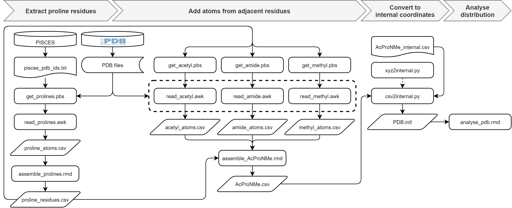
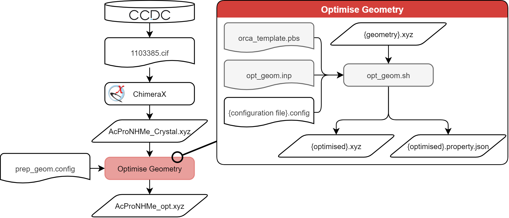
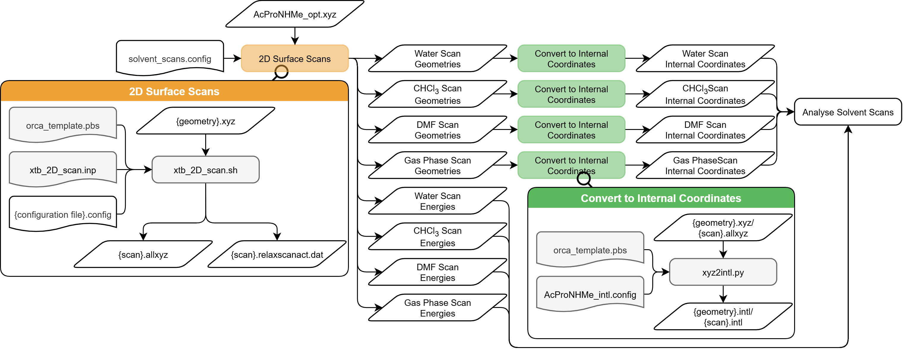
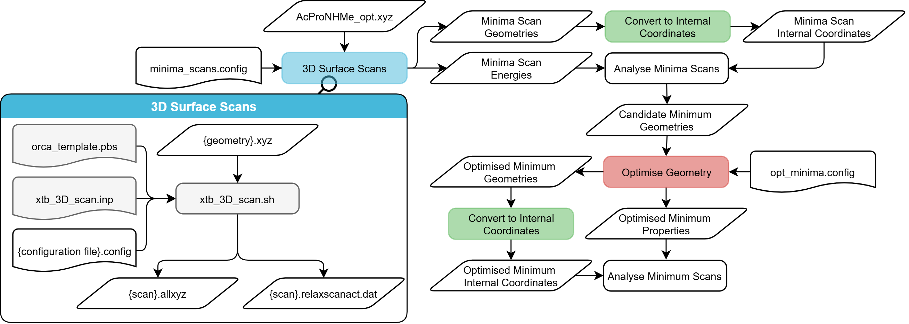
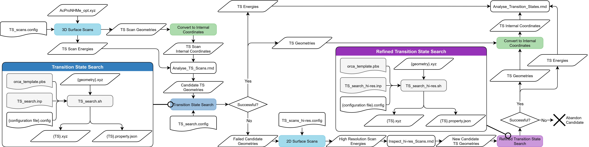
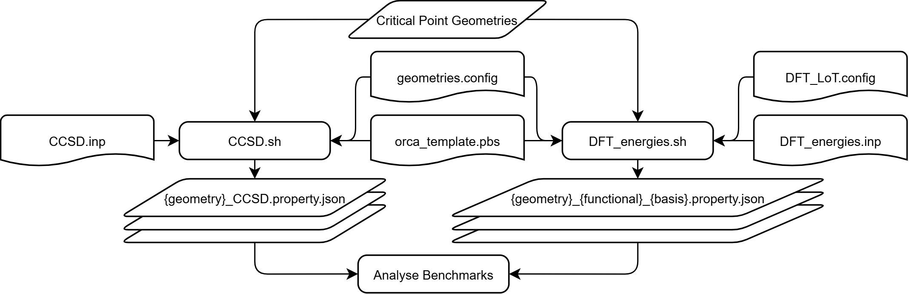

# Prolyl Isomerisation Benchmark

This repository contains the data and scripts required to reproduce the results from my MSc thesis _On the Computational Modelling of Prolyl–Peptide_ cis–trans _Isomerisation: Benchmarking DFT Approaches with N–Acetylproline Methylamide_

## Repository Structure

```
.
├── Data/              # Raw and processed dataset files
├── Images/            # Flow diagrams used in this README
└── Scripts/           # Analysis and processing scripts with configuration files
```

## Requirements

To reproduce this analysis, you will need:

- Python 3.x
- Required Python packages:
  - Numpy 1.24.x
- R 4.3.x
- Required R packages:
  -  tidyverse
  -  hrbrthemes
  -  cetcolor
  -  jsonlite
  -  legendry
  -  ggtext
  -  ggsci
  -  ggh4x
- ORCA 6.0 (with xtb)

## Usage

### Analysis of the conformational distribution of prolyl residues in the PDB



#### 1. Prepare proline geometries

1. Select your set of proteins and download their `.pdb` crystallographic coordinates to a dedicated directory. 
2. Write their PDB ids of the proteins into a newline ("\\n") separated text file [pisces_pdb_ids.txt](./Data/PDB Conformations/pisces_pdb_ids.txt). The files must be named `{ID}.pdb`, where {ID} is its PDB id.
3. Read the atomic coordinates of the proline residues with `get_prolines.pbs`. `read_proline.awk` must be in the same directory as `get_prolines.pbs`. Set the path to the PDB directory in the script before executing:
```shell
qsub get_prolines.pbs
```
4. Use the `assemble_prolines.rmd` R notebook to pivot `proline_atoms.csv` to a wide format.

#### 2. Add adjacent groups

1. Read the atoms from adjacent residues by executing `get_acetyl.pbs`, `get_amide.pbs` and `get_methyl.pbs`. `read_acetyl.awk` must be in the same directory as `get_acetyl.pbs`, `read_amide.awk` must be in the same directory as `get_amide.pbs`, and `read_methyl.awk` must be in the same directory as `get_methyl.pbs`. Each directory must also contain the wide-format proline coordinates (`proline_residues.csv`) . Set the path to the PDB directory in each script before executing:
```shell
qsub get_acetyl.pbs
qsub get_amide.pbs
qsub get_methyl.pbs
```
2. Combine atoms from adjacent residues with the wide-format residue records with the `assemble_AcProNMe.rmd` R notebook. This requires the files for the atomic coordinates of the proline residues (`proline_residues.csv`), and the adjacent groups (`acetyl_atoms.csv`, `amide_atoms.csv` and `methyl_atoms.csv`).

#### 3. Convert Cartesian atomic coordinates to internal coordinates

Execute `csv2internal.py` to generate internal coordinates for each residue. `csv2internal.py` imports modules from `xyz2internal.py` - ensure this script is included in the environment or working directory. `csv2internal.py` takes three arguments: 
1) the path to the Cartesian coordinates (`AcProNMe.csv`)
2) the path to the configuration file defining the internal coordinates (`AcProNMe_internal.config`)
3) the path for the output (`PDB.intl`)

```shell
python csv2internal.py ./AcProNMe.csv ./AcProNMe_internal.config ./PDB.intl
```

#### 4. Filter and generate figures of the conformational distribution

Use `analyse_pdb.rmd` to analyse the distribution of conformations within the PDB sample (`PDB.intl`).

### ORCA Computational Chemistry Overview

This repository provides shell scripts for preparation and execution of various ORCA computations (geometry optimisation, 2D relaxed surface scans, 3D relaxed surface scans, transition state searches, DFT single point energies, and CCSD(T) single point energies with CBS extrapolation). 

This scheme simplifies the execution of a large number of ORCA jobs in parallel using the following files:
- **{task}.inp**: These are template ORCA input files specifying the parameters for a basic ORCA run
- **{task}.config**: These semicolon-delimited files list the job names, input file paths, and job-specific parameters. Each line provides specifications for a new ORCA run.
- **orca_template.pbs**: This is a template PBS jobscript from which the jobscripts for all the ORCA jobs are generated. The resulting jobscript specifies the resource assignment for the PBS scheduler, generates a temporary working directory in the (manually) specified location, and initiates the ORCA run.
- **{task.sh}**: This bash shell script generates output directories, populates the `{task}.inp` and `orca_template.pbs` templates, and submits the jobscript to the PBS job queue for each line in `{task}.config`.

### Preparation of the starting geometry



Optimise the geometry of the AcProNHMe crystallographic structure `AcProNHMe_Crystal.xyz` at the r<sup>2</sup>SCAN-3c level of theory by executing `opt_geom.sh`. The script requires a configuration file (`geom_prep.config)` listing the job name and the path to the atomic coordinates separated by a semicolon. Ensure the ORCA geometry optimisation input file (`opt_geom.inp`) and the template jobscript (`orca_template.pbs`) are included in the working directory or PATH variables.

```shell
./opt_geom.sh  geom_prep.config
```

### Solvated relaxed surface scans



This section makes use of the initial optimised geometry generate in the [Preparation of the starting geometry Section](#preparation-of-the-starting-geometry).

#### 1. Execute relaxed surface scans 

Run the `xtb_2D_scan.sh` script, starting at the optimised starting geometry (`AcProNHMe_opt.xyz`).

```shell
./xtb_2D_scan.sh solvent_scans.config
```

The semicolon-delimited configuration file (`solvent_scans.config`) has the following columns:
```csvs
Job Name; Path to Starting Geometry; First Scan Coordinate; Second Scan Coordinate; Solvent
```

The scan coordinates specify the scanning dimension, starting coordinate, end coordinate and number of steps for each scanning dimension in the ORCA `%geom SCAN` format.

#### 2. Convert the Cartesian atomic coordinates to internal coordinates

Use `xyz2internal.py` to generate internal coordinates for each scan. The script takes three arguments: 
1) the path to the atomic coordinates (`xtb_H2O_scan.allxyz`/`xtb_CHCl3_scan.allxyz`/`xtb_DMF_scan.allxyz`/`xtb_gas_scan.allxyz`),
2) the path to the internal coordinate configuration file (`AcProNHMe_internal.config`)
3) the output path (`xtb_H2O_scan.intl`/`xtb_CHCl3_scan.intl`/`xtb_DMF_scan.intl`/`xtb_gas_scan.intl`).

```shell
python xyz2internal.py xtb_{solvent}_scan.allxyz AcProNHMe_internal.config xtb_{solvent}_scan.intl
```

#### 3. Analyse the surface scans 

Use the `Analyse_solvent_scans.rmd` R notebook to plot the results and identify local minima. The notebook requires the internal coordinates for all the surface scans (`xtb_{solvent}_scan.intl`), and the single point energies of each geometry (`xtb_{solvent}_scan.relaxscanact.dat`)


### Explore gas-phase reaction paths

This section makes use of the initial optimised geometry generate in the [Preparation of the starting geometry Section](#preparation-of-the-starting-geometry).

####  Identification of minimum energy geometries



##### 1. _Trans_ relaxed surface scans

Execute `xtb_3d_scans.sh` to scan the _trans_ conformational landscape starting with the initial optimised geometry (`AcProNHMe_opt.xyz`).


```shell
./xtb_3d_scans.sh minima_scans.config
```

The configuration file (`minima_scans.config`) has the following columns:
```csvs
Job Name; Path to Starting Geometry; First Scanning Coordinate; Second Scanning Coordinate; Third Scanning Coordinate
```

##### 2. Convert the Cartesian atomic coordinates to internal coordinates

```shell
python xyz2internal.py minima_fwd_scan.allxyz AcProNHMe_internal.config minima_fwd_scan.intl
python xyz2internal.py minima_rev_scan.allxyz AcProNHMe_internal.config minima_rev_scan.intl
```

##### 3. Identify local minima

Use the `minima_scans.rmd` R notebook to plot the results and identify local minima. The notebook requires the internal coordinates for all the surface scans (`minima_fwd_scan.intl`/`minima_rev_scan.intl`), and the single point energies of each geometry (`minima_fwd_scan.relaxscanact.dat`/`minima_rev_scan.relaxscanact.dat`)

##### 4. Optimise local minima

Optimise the geometry of the approximate local minima (`minima_fwd_scan.940.xyz`/`minima_fwd_scan.1524.xyz`/`minima_fwd_scan.44007.xyz`/`minima_fwd_scan.44678.xyz`) at the R<sup>2</sup>SCAN-3c level op theory by executing `opt-geom.sh`.

```shell
./opt_geom.sh opt_minima.config
```

##### 5. Convert the Cartesian atomic coordinates to internal coordinates

Generate internal coordinates for the optimised local minima.

```shell
python xyz2internal.py minima_fwd_scan.940.xyz AcProNHMe_internal.config transG_g-endo.intl
python xyz2internal.py minima_fwd_scan.1534.xyz AcProNHMe_internal.config transG_g-exo.intl
python xyz2internal.py minima_fwd_scan.44007.xyz AcProNHMe_internal.config cisD_g-exo.intl
python xyz2internal.py minima_fwd_scan.44678.xyz AcProNHMe_internal.config cisA_g-endo.intl
```

##### 6. Characterise local minima

Use the `Analyse_minima.rmd` R notebook to calculate puckering coordinates and tabulate the properties of the local minimum geometries. This notebook requires the internal coordinates of all optimised minima (`transG_g-endo.intl`/`transG_g-exo.intl`/`cisD_g-exo.intl`/`cisA_g-endo.intl`) and their ORCA property files (`minima_fwd_scan.940.property.json`/`minima_fwd_scan.1534.property.json`/`minima_fwd_scan.44007.property.json`/`minima_fwd_scan.44678.property.json`).

#### Identification of gas-phase transition state geometries



##### 1. Isomerisation path relaxed surface scans

Execute `xtb_3d_scans.sh` to scan the conformational landscape between the _cis_ and _trans_ isomeric states, starting with the initial optimised geometry (`AcProNHMe_opt.xyz`). 

```shell
./xtb_3d_scans.sh TS_scans.config
```

##### 2. Convert the Cartesian atomic coordinates to internal coordinates

```shell
python xyz2internal.py TS_ff_scan.allxyz AcProNHMe_internal.config TS_ff_scan.intl
python xyz2internal.py TS_fr_scan.allxyz AcProNHMe_internal.config TS_fr_scan.intl
python xyz2internal.py TS_rf_scan.allxyz AcProNHMe_internal.config TS_rf_scan.intl
python xyz2internal.py TS_rr_scan.allxyz AcProNHMe_internal.config TS_rr_scan.intl
```

##### 3. Identify candidate transition states

Use the `Analyse_TS_scans.rmd` R notebook to plot the results and identify saddle points. The notebook requires the internal coordinates for all the surface scans (`TS_ff_scan.intl`/`TS_fr_scan.intl`/`TS_rf_scan.intl`/`TS_rr_scan.intl`), and the single point energies of each geometry (`TS_ff_scan.relaxscanact.dat`/`TS_fr_scan.relaxscanact.dat`/`TS_rf_scan.relaxscanact.dat`/`TS_rr_scan.relaxscanact.dat`).

##### 4. Optimise candidate transition states

### Benchmark of DFT functionals

\

#### Calculate CCSD(T)/CBS single point energies


#### Calculate DFT single point energies


#### Analyse the accuracy of each DFT functional

## License
[GNU General Public License v3.0
](./LICENSE)
